# 功能解析 · 小说创作工作台

> 一份把"大纲、角色、线路、正文、伏笔、设定"放进同一个项目、并让 AI 助手能**直接读写这些数据**的本地写作工具。
> 全部数据存在本机，不上传、不注册、不索取任何平台账号。

---

## 一、它想解决什么问题

写长篇的人大多经历过这些：

- 大纲写在文档里、角色卡写在另一个文件里、伏笔记在便签上 —— 想找"这个人物第一次出场时什么性格"要翻三个地方；
- AI 助手很好用，但它**看不见你的项目**，每次都要把设定重新贴一遍；
- 贴进去之后，它只会给建议，**改还得你自己动手**；
- 写到第 80 章，早埋的伏笔忘了回收，某个人物的动机前后打架。

这个工作台的答案很直接：**把结构化的写作数据放在一处，并让 AI 拿到读写的钥匙。**

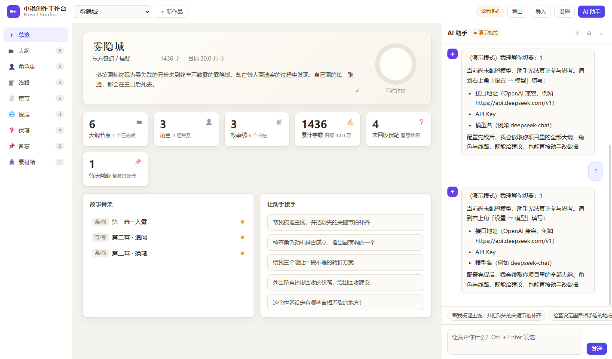

---

## 二、九个模块

左侧是九个模块，彼此通过"关联"串起来，而不是九个孤立的列表。

### 1. 总览

一屏看清这部作品的状态：大纲节点数、角色数、故事线数、累计字数、**未回收的伏笔数**、待解决的问题数。

下方两块是入口：**故事骨架**（三幕结构）和**让助手接手**（几个常见指令，点一下就把问题交给右侧的 AI）。
被标记的故事骨架节点会显示三个点，表示该幕下有内容。

### 2. 大纲

树形结构：幕 / 卷 → 章 → 场景 → 节拍，可拖拽调序、可折叠。

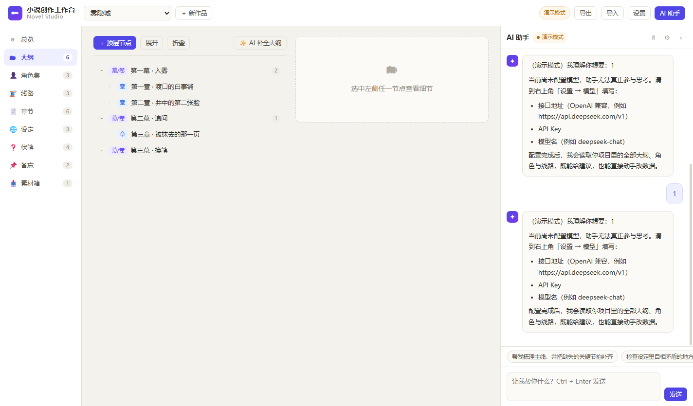

每个节点能写摘要、标状态（灵感 / 待写 / 草稿 / 完成），并且能看到**这个节点下挂了哪些章节、哪些节拍**——这就是"结构"和"正文"之间的双向索引。

### 3. 角色集

不只是姓名表，而是一张**能驱动情节的卡片**：别名、年龄、外貌、性格、动机、弱点、人物弧光，以及"转折"。

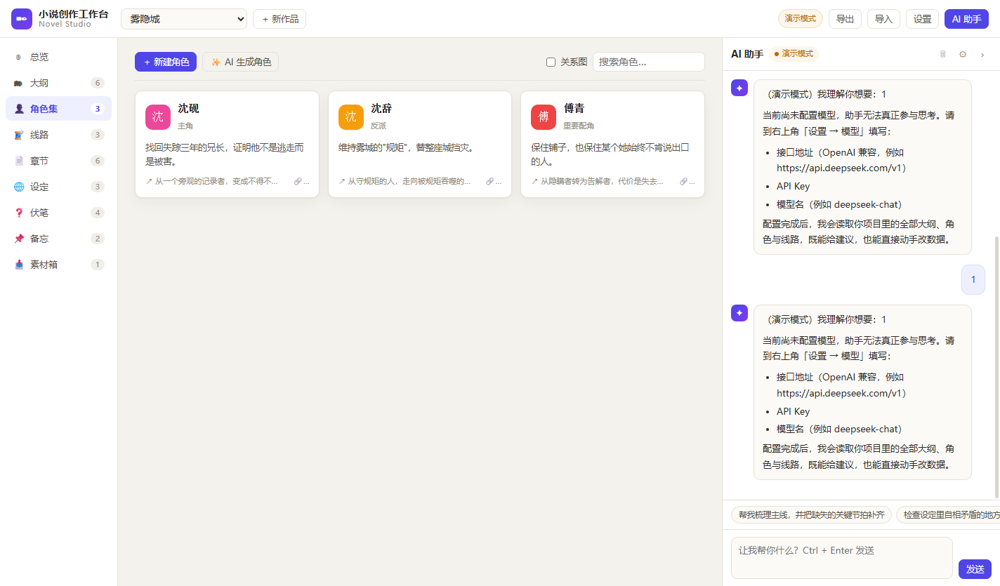

角色之间可以连线成**关系网**（谁欠谁、谁在骗谁），关系图可切换显示。

### 4. 线路

主线、副线、感情线、悬念线、成长线，按**泳道**横向排列，每条线上是一个个节拍。

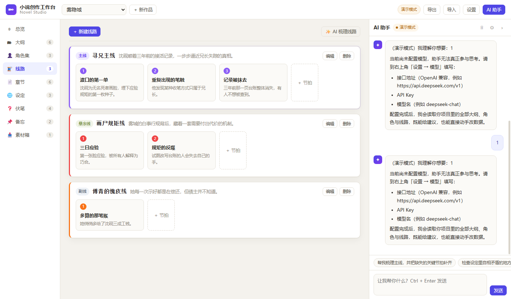

每条节拍都能**关联到某个大纲节点**，于是"这条线在第 12 章推进到哪里"一眼可见。线路可以标记颜色，泳道会跟着变色。

### 5. 章节

左列是章节清单，右列是正文编辑器。

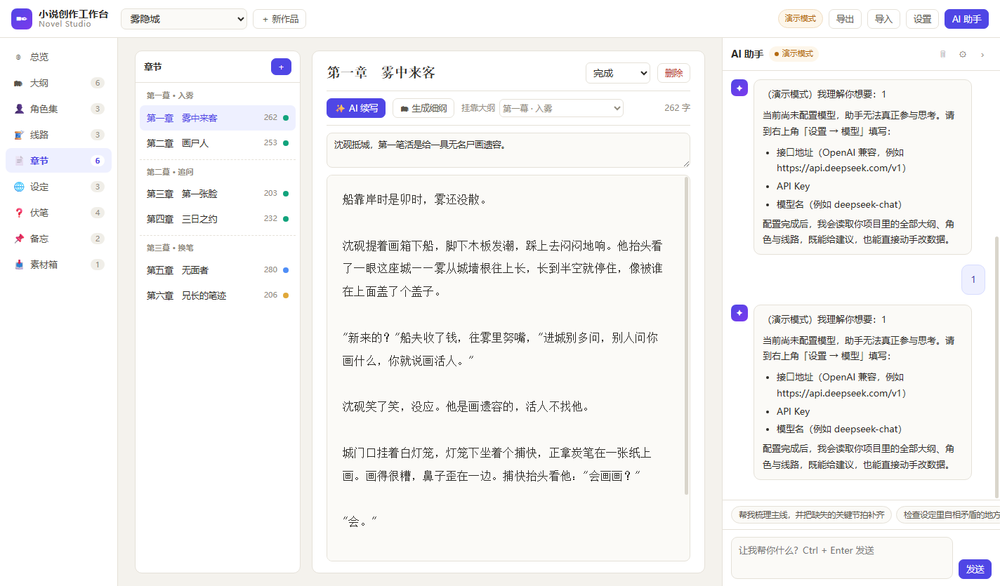

- 章节可以**挂靠到大纲节点**（截图右上"挂靠大纲"就是这个），挂上之后，章节清单会**自动按卷分组**显示——上面截图里"第一幕 · 入雾 / 第二幕 · 追问 / 第三幕 · 换笔"三个分组标题就是这么来的；
- 正文支持 AI 续写（可给指令、可指定字数）、生成细纲；
- 写的时候有防抖自动保存，切换章节不丢稿。

### 6. 设定

世界观的条目化：地理 / 历史 / 规则 / 势力 / 物品 / 习俗 / 种族 / 其他，按类分组。

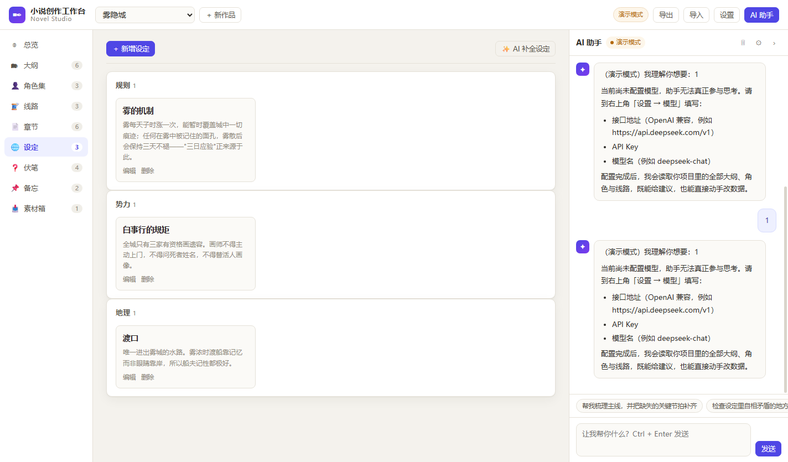

规则类设定尤其有用——比如截图里"雾的机制"，它解释了全书那个核心悬念的因果。

### 7. 伏笔

分"已埋 / 已回收"两态，可以写**回收提示**（打算在哪回收、怎么回收）。

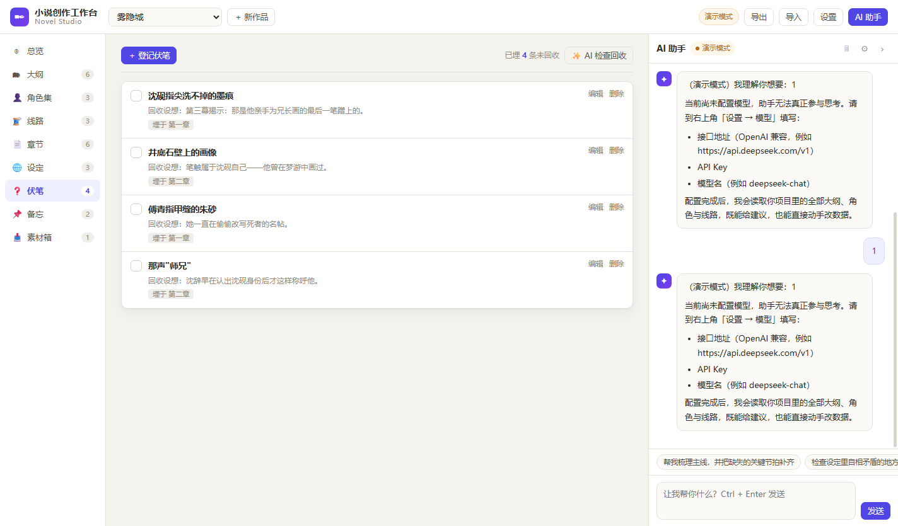

总览页那个"未回收伏笔"计数就是从这里来的——写长了最容易崩的就是这个。

### 8. 备忘

随手记的想法、待办、要查的资料，可分可钉。

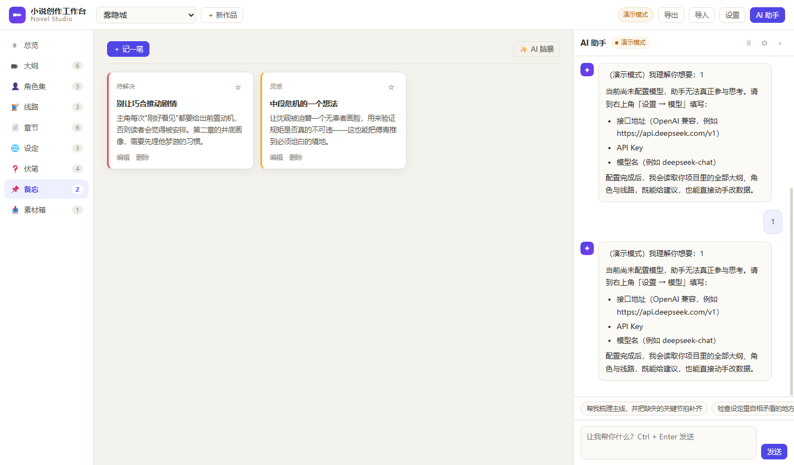

### 9. 素材箱

放从别处搬来的东西：和 AI 的灵感对话、参考段落、设定碎片。

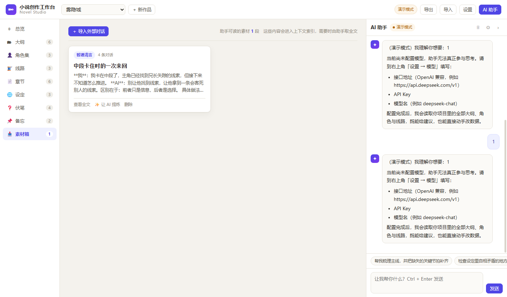

素材箱**不把全文塞进上下文**——列表里只放标题 + 160 字预览，AI 需要全文时用 `read_material` 工具按需取。这是为了长篇不把上下文撑爆。

---

## 三、AI 助手：不是陪聊，是能动手的

右侧常驻面板，它能**读你的全部项目数据，也能直接改**。

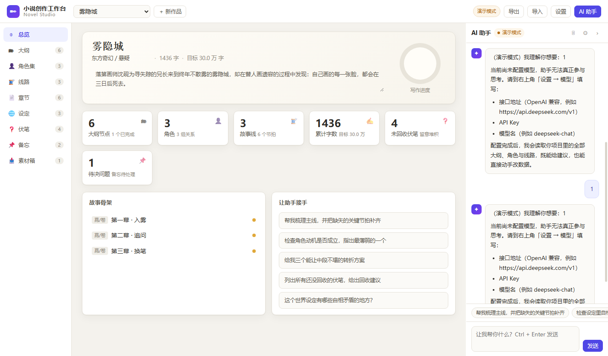

### 三重降级，任何情况都不卡死

| 情况 | 行为 |
| --- | --- |
| 配好 API Key | 正常多轮工具调用 |
| 模型不支持 function calling | 自动切换为 JSON 文本协议（解析模型输出的工具调用块） |
| 完全没配 Key | **演示模式**：仍然产出可用的骨架内容，流程可完整体验 |

### 它实际能做的事（13 个工具）

新建/修改**大纲节点**、**角色**、**人物关系**、**故事线**、**节拍**、**章节**、**伏笔**、**世界观条目**、**备忘**；拉取项目上下文；读取素材全文。

所以你可以直接说"帮我梳理主线，并把缺失的关键节拍补齐"——它会去读你已有的大纲，然后**真的把节拍写进去**，而不是回你一段建议。

### 生成类功能走"先看再用"

细纲、线路、角色这类批量生成，统一是**生成 → 勾选预览 → 应用**，不让 AI 一次把脏数据灌进项目。

---

## 四、导入与导出

### 导入

点顶栏「导入」，两种来源：

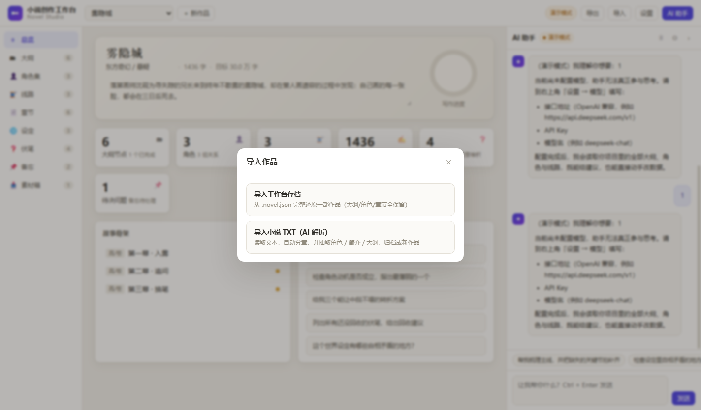

**① 工作台存档（.novel.json）**：完整还原一部作品，大纲 / 角色 / 章节全部保留。

**② 小说 TXT 批量导入**——这是给"手里已经有一堆 txt"的场景做的：

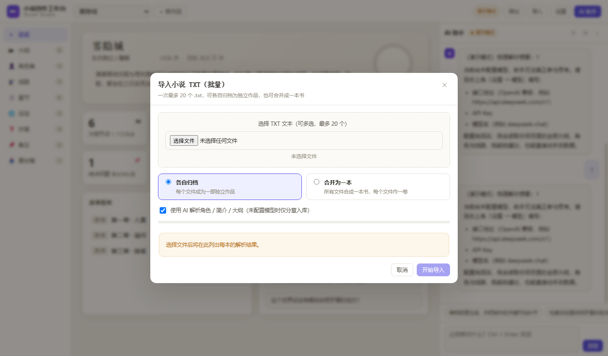

- **一次最多 20 个文件**，可多选；
- 选完立刻**分章预览**：每个文件显示识别到的章数和字数；
- 两种归档方式：
  - **各自归档**：每个文件成为一部独立作品；
  - **合并为一本**：所有文件合成一本书，**每个文件作一卷**，章节自动挂到对应卷下（「章节」页就会按卷分组显示）；
- 每个文件可单独改作品名 / 类型，也可单独移除；
- 导入逐个进行，**有实时进度**（"正在导入 3 / 20：xxx.txt"），**单本失败可单独重试**，不影响其它；
- 勾选「使用 AI 解析」后，会额外抽取**书名 / 类型 / 一句话简介 / 核心角色 / 叙事阶段 / 世界观**；没配模型时自动退化为"仅分章入库"，功能照样可用。

分章器认这些写法：`第一章`、`第 123 回`、`第 12 卷`、`Chapter 4`、以及 `序章 / 楔子 / 引子 / 终章 / 尾声 / 番外` 等特殊标记；中文数字章号（一、十二、一百二十三）也能识数。认不出分章标记时，整本作为单章正文导入。

### 导出

同一部作品可以导出为 **Markdown**（给编辑看、存档阅读）或 **JSON**（完整还原回工作台）。

---

## 五、两个互不干扰的实例

同一份代码可以跑出**两个完全隔离的实例**，各有各的数据目录、端口和模型设置：

| | 数据目录 | 用途 |
| --- | --- | --- |
| **写作端** | `data-work/` | 你的真实草稿 |
| **展示端** | `data-demo/` | 演示用，首次启动自动载入示例作品 |

两边**可以同时开着**。演示给别人看时，既不会暴露未定稿，也不会被人误改。

---

## 六、桌面安装包

打包成 Windows 安装包后：

- 双击安装（**按用户安装，不需要管理员权限**），桌面和开始菜单都有图标；
- 目标电脑**不需要装 Node、不需要浏览器、不依赖任何其它软件**；
- 内置服务用**系统分配的随机空闲端口**，不会和你机器上其它服务抢端口；
- 数据存在 `%APPDATA%\小说创作工作台\data\`，重装升级不丢；首次启动自动铺一份示例作品。

---

## 七、技术上的几个选择

- **零依赖**：服务端只用 Node 内置模块（`http` + 手写迷你路由），前端是原生 ES Module，没有构建步骤。装完就能改，改完刷新就生效。
- **JSON 持久化**：数据落在 `data/store.json`，150ms 防抖写盘 + 临时文件原子替换，文件损坏会自动备份成 `.broken-*`。
- **本地优先**：数据不出本机。模型调用只发生在你自己配置的那个接口上，请求里带的是你当前项目的上下文。
- **关于"同步别家 AI 平台会话"**：做不到也不该做——消费级 AI 产品与开放平台是两套体系，没有读取其会话的接口；任何号称"一键同步"的方案本质是要你交出登录凭证。**正当路径是官方导出 → 本地导出插件（浏览器内处理、不上传）→ 手动粘贴**。请不要把 Cookie 或密码交给任何一键同步工具。

---

## 八、截图一览

| 视图 | 文件 |
| --- | --- |
| 总览 | `docs/images/view-dashboard.png` |
| 大纲 | `docs/images/view-outline.png` |
| 角色集 | `docs/images/view-characters.png` |
| 线路 | `docs/images/view-lines.png` |
| 章节（含按卷分组） | `docs/images/view-chapters.png` |
| 设定 | `docs/images/view-world.png` |
| 伏笔 | `docs/images/view-foreshadow.png` |
| 备忘 | `docs/images/view-notes.png` |
| 素材箱 | `docs/images/view-materials.png` |
| 导入菜单 | `docs/images/import-menu.png` |
| 批量导入 TXT | `docs/images/import-txt.png` |
| 模型设置 | `docs/images/settings.png` |
